# Interview Prep Agent — Full Documentation

An AI-powered iOS application for structured technical and behavioral interview preparation. This document covers every screen of the app, the full system architecture, and an end-to-end example walkthrough using real session data captured from the app.

---

## Table of Contents

1. [System Architecture](#1-system-architecture)
2. [Home Dashboard](#2-home-dashboard)
3. [Mock Interview](#3-mock-interview)
   - [Setup](#31-setup)
   - [Live Session](#32-live-session)
   - [Feedback & Scoring](#33-feedback--scoring)
   - [End Session](#34-end-session)
4. [FAQ & Study](#4-faq--study)
   - [Ask a Question](#41-ask-a-question)
   - [Generate Flashcards](#42-generate-flashcards)
5. [Flashcard Review](#5-flashcard-review)
6. [Progress Dashboard](#6-progress-dashboard)
7. [End-to-End Example Walkthrough](#7-end-to-end-example-walkthrough)

---

## 1. System Architecture

The app is split into two layers — an iOS client that owns all state, and a stateless FastAPI backend that handles all AI inference via Groq.

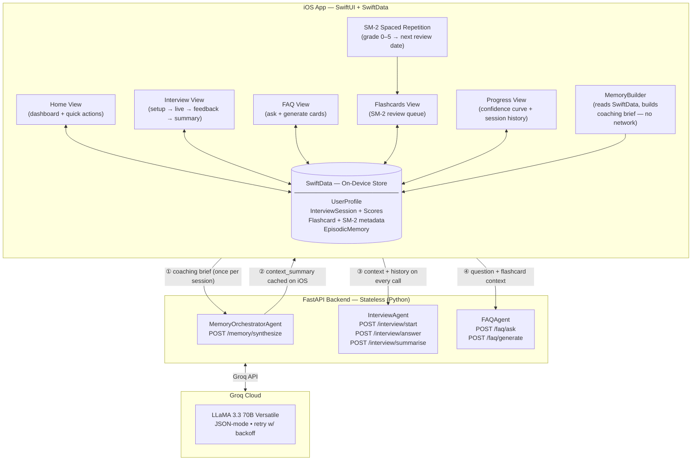

### Key architectural decisions

| Decision | Why |
|----------|-----|
| **Backend is fully stateless** | Every request carries the full conversation history and coaching brief. No session store needed — the backend can scale horizontally without coordination. |
| **SwiftData as single source of truth** | All user data (sessions, scores, flashcards, memories) lives on-device. The backend never persists anything. |
| **Coaching brief synthesized once per session** | `MemoryBuilder` reads SwiftData locally and calls `/memory/synthesize` once at session start. The returned brief is cached in memory and attached to every subsequent API call — so the AI always has full context without repeated synthesis calls. |
| **SM-2 runs entirely on-device** | The spaced repetition scheduling algorithm has no backend dependency. Grading a card updates ease factor and next-review date locally and instantly. |
| **JSON-mode + exponential backoff** | All three agents request structured JSON responses from the LLM and retry up to 4 times with exponential backoff on rate limit or server errors. |

### Request flow for one interview answer

```
User submits answer
  │
  ├─ iOS builds session_delta locally   (no network)
  ├─ iOS appends answer to history[]    (no network)
  │
  └─▶ POST /interview/answer
        body: { role, level, domain, context, session_delta, history[], answer }
          │
          └─▶ InterviewAgent._system()   builds system prompt from context + domain
              InterviewAgent.evaluate()  calls Groq with JSON-mode
                │
                └─▶ LLaMA 3.3 70B
                      │
                      └─▶ { scores, feedback, topic, next_question }
                            │
                            └─▶ iOS renders feedback card
                                iOS saves score to SwiftData
                                iOS appends next_question to history[]
```

---

## 2. Home Dashboard

<p align="center">
  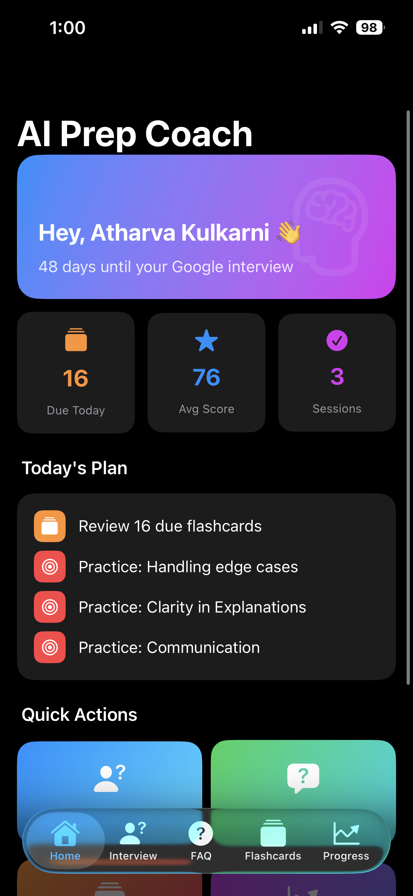
</p>

The home screen is the first thing the user sees on every app open. It gives an instant read on where things stand and what to do next — without requiring any navigation.

**Hero card** — Personalised greeting with the user's name and a live countdown to their target interview. The gradient card makes the deadline feel real and creates urgency.

**Stats row** — Three numbers at a glance:
- **Due Today** — Flashcards whose SM-2 review date has arrived (16 in this session). Shown in orange when non-zero to signal action needed.
- **Avg Score** — Rolling average across the last 7 completed interview sessions (76 here).
- **Sessions** — Total completed sessions (3).

**Today's Plan** — Dynamically generated from SwiftData. The app surfaces:
- Due flashcard count if cards are waiting
- Weak spots ranked by frequency across all sessions (Handling edge cases, Clarity in Explanations, Communication)

**Quick Actions** — One-tap navigation to each of the four main sections: Mock Interview, Ask a Question, Flashcards, Progress.

> All data on this screen is read directly from SwiftData — no network call is made on home screen load.

---

## 3. Mock Interview

### 3.1 Setup

<p align="center">
  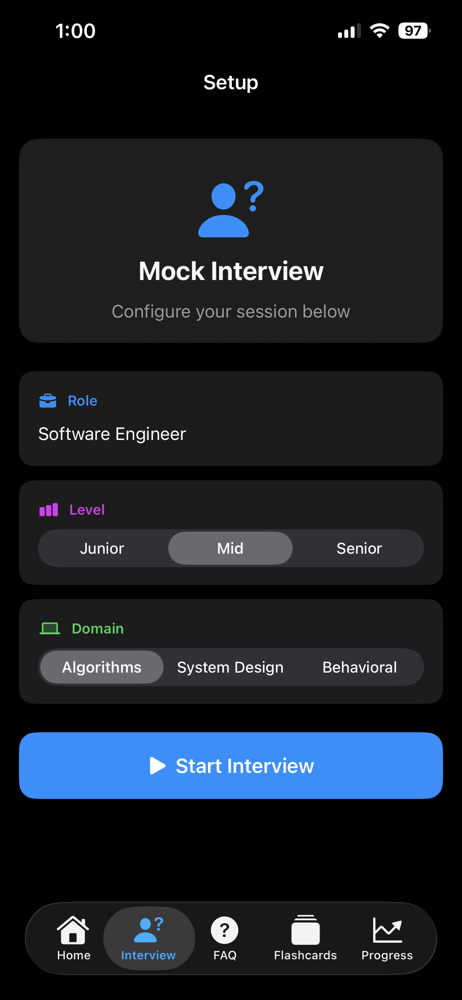
  &nbsp;&nbsp;
  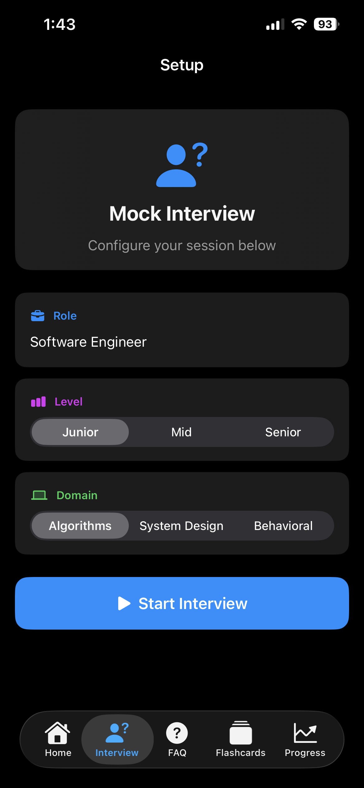
</p>

Before starting, the user configures three parameters:

**Role** — Free text. Defaults to "Software Engineer". The role is passed as context to the AI interviewer to calibrate question phrasing and depth.

**Level** — Segmented picker: Junior / Mid / Senior. Controls difficulty and what the evaluator expects in an answer. A Junior answer that shows solid fundamentals scores well; the same answer at Senior level would be marked down for missing architectural thinking.

**Domain** — Three choices:
- **Algorithms** — DSA questions: arrays, graphs, dynamic programming, sliding window, recursion
- **System Design** — High-level architecture, capacity estimation, trade-offs
- **Behavioral** — STAR-format questions only: conflict, leadership, failure, influence

The domain lock is enforced by the AI system prompt — follow-up questions are always kept within the chosen domain regardless of what the candidate mentions in their answer.

---

### 3.2 Live Session

<p align="center">
  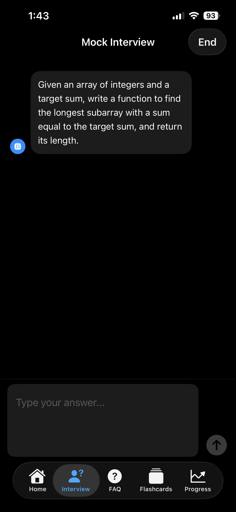
  &nbsp;&nbsp;
  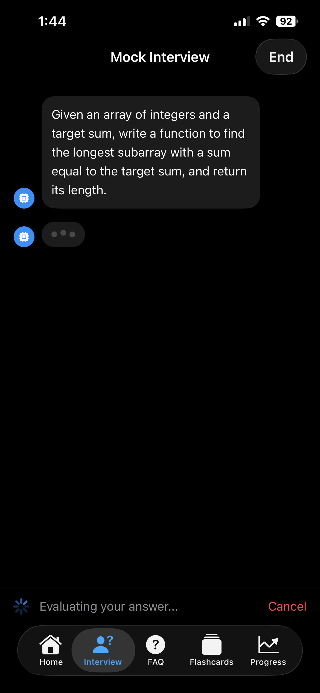
</p>

**Question delivery** — The opening question arrives from `/interview/start`. Subsequent questions come embedded in each `/interview/answer` response. The full conversation is rendered in a chat-style feed — interviewer bubbles on the left, candidate answers on the right.

**Example question shown:**
> *"Given an array of integers and a target sum, write a function to find the longest subarray with a sum equal to the target sum, and return its length."*

**Answer input** — Multi-line text field at the bottom. The candidate types their explanation, approach, and code (if applicable) in plain text. There is no time limit — the focus is on quality of reasoning.

**Evaluating state** — After submission, the app shows `Evaluating your answer...` with a loading indicator and a Cancel option. The backend is calling Groq with the full conversation history and the candidate's answer. Typical response time is 1–3 seconds.

**End button** — Always visible top-right. Tapping it triggers the End Session confirmation dialog.

---

### 3.3 Feedback & Scoring

<p align="center">
  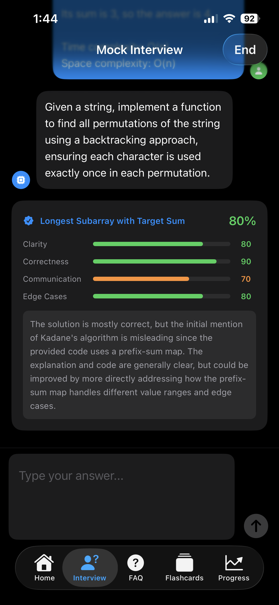
</p>

After each answer the AI returns a structured feedback card pinned in the conversation.

**Score card** — Shows the topic that was tested and an overall percentage, then breaks it down across four rubric dimensions, each rendered as a colour-coded progress bar:

| Dimension | Score | What it measures |
|-----------|-------|-----------------|
| Clarity | 80 | How clearly the answer is communicated |
| Correctness | 90 | Technical accuracy of the solution |
| Communication | 70 | Structure, pacing, and how the candidate walks through their thinking |
| Edge Cases | 60 | Whether boundary conditions and failure modes are considered |

**Feedback text** — 2–3 sentences of specific, actionable critique. In this example:
> *"The solution is mostly correct, but the initial mention of Kadane's algorithm is misleading since the provided code uses a prefix-sum map. The explanation and code are generally clear, but could be improved by more directly addressing how the prefix-sum map handles different value ranges and edge cases."*

**Next question** — Immediately follows the feedback in the conversation. The session continues without any user action needed.

The score for this exchange is saved to SwiftData and contributes to the Progress Dashboard and the next coaching brief.

---

### 3.4 End Session

<p align="center">
  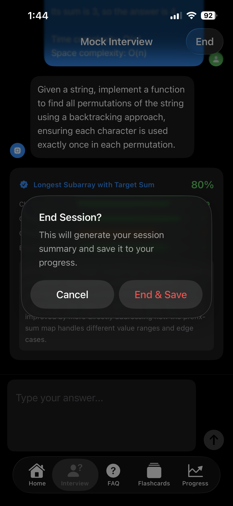
</p>

Tapping **End** at any point brings up a confirmation sheet. Choosing **End & Save** triggers three things:

1. `POST /interview/summarise` — sends all collected scores to the backend, which returns an overall score, strong areas, weak spots, and the single most important topic to study next.
2. The session summary is written to SwiftData as a new `InterviewSession` record.
3. A new `EpisodicMemory` entry is created from the summary — it will appear in the next `/memory/synthesize` call so future sessions know what happened in this one.

Choosing **Cancel** returns to the live session with no data lost.

---

## 4. FAQ & Study

### 4.1 Ask a Question

<p align="center">
  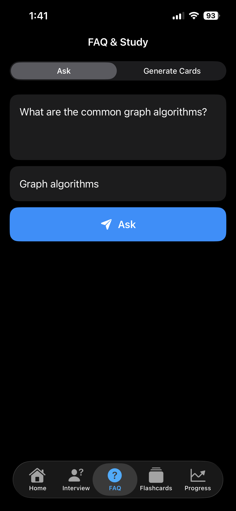
  &nbsp;&nbsp;
  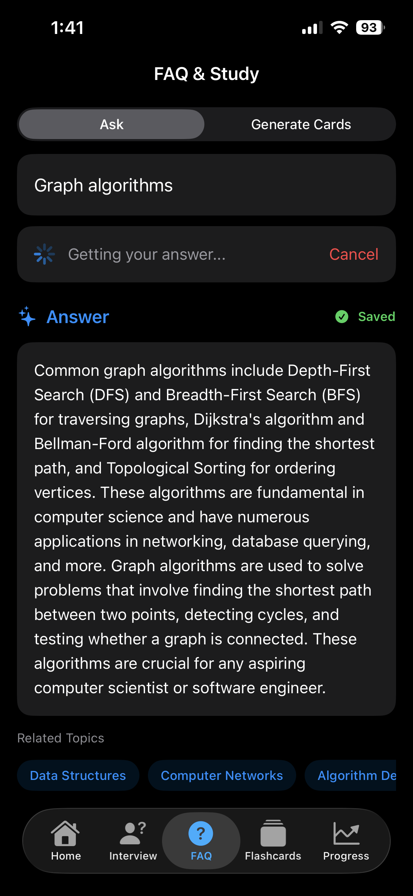
</p>

**Input** — The user types a question in natural language and optionally provides a topic tag. The topic is used to pull relevant flashcards from SwiftData before the API call — so if the user already has cards on this subject, the AI will reference and reinforce them.

**Example question:** *"What are the common graph algorithms?"*
**Topic tag:** *Graph algorithms*

**Answer** — Returned from `/faq/ask` and displayed below the question. The answer is personalised using the user's coaching profile. In this case:

> *"Common graph algorithms include Depth-First Search (DFS) and Breadth-First Search (BFS) for traversing graphs, Dijkstra's algorithm and Bellman-Ford algorithm for finding the shortest path, and Topological Sorting for ordering vertices..."*

**Saved badge** — When the backend returns `"save_as_flashcard": true`, the app automatically creates a new flashcard from the Q&A pair and adds it to the SwiftData store. The green **Saved** badge confirms this. The card enters the SM-2 queue with a first review due the next day.

**Related Topics** — Chips at the bottom (Data Structures, Computer Networks, Algorithm Design) let the user quickly pivot to adjacent subjects.

---

### 4.2 Generate Flashcards

<p align="center">
  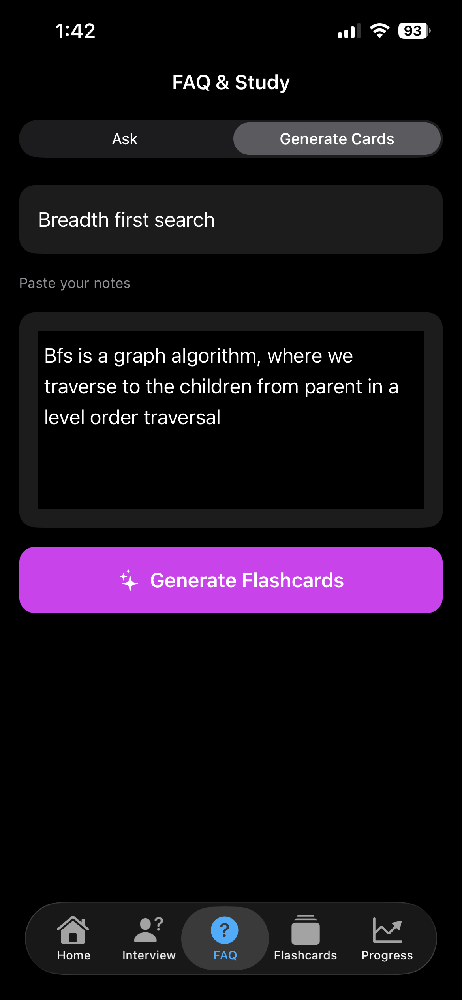
  &nbsp;&nbsp;
  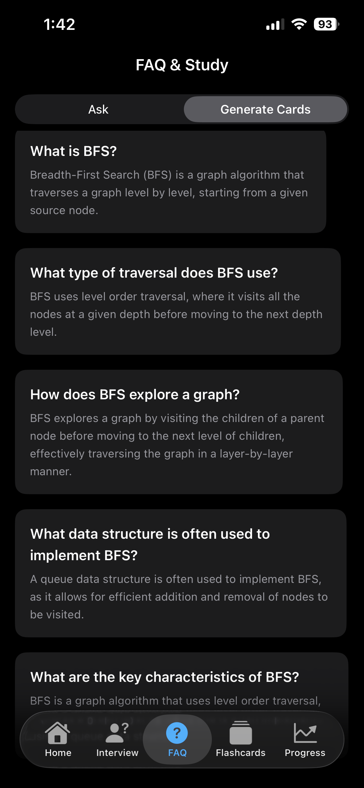
</p>

**Input** — The user provides a topic name and pastes raw study notes. Notes can be rough — bullet points, incomplete sentences, copied textbook paragraphs. The AI handles the structuring.

**Example input:**
- Topic: *Breadth first search*
- Notes: *"BFS is a graph algorithm, where we traverse to the children from parent in a level order traversal"*

**Generated cards** — The backend returns 5–15 flashcards depending on note density. For this input, 5 cards were generated:

1. What is BFS?
2. What type of traversal does BFS use?
3. How does BFS explore a graph?
4. What data structure is often used to implement BFS?
5. What are the key characteristics of BFS?

Each card is saved to SwiftData with:
- Default ease factor: 2.5
- Repetitions: 0
- First review: tomorrow

All cards immediately appear in the Flashcards tab under **Due Today**.

---

## 5. Flashcard Review

<p align="center">
  
  &nbsp;&nbsp;
  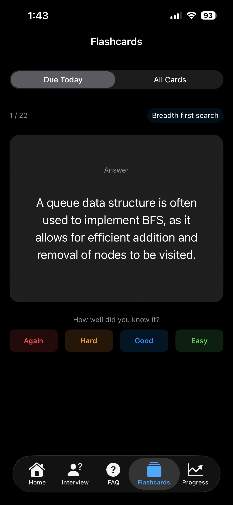
</p>

<p align="center">
  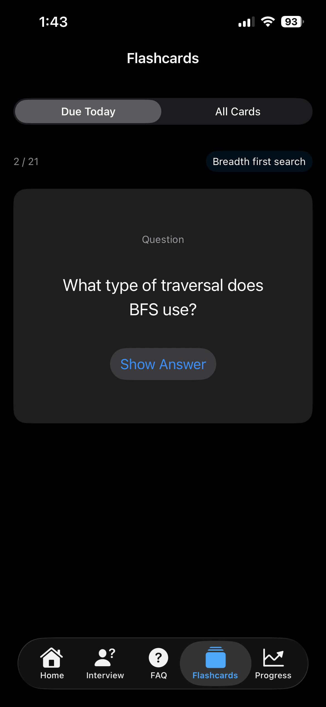
  &nbsp;&nbsp;
  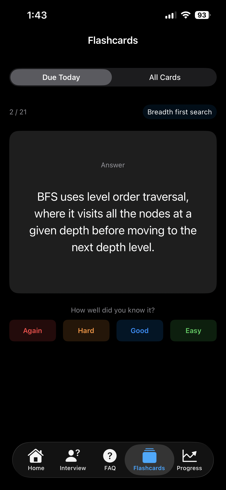
</p>

**Due Today tab** — Shows only cards whose SM-2 scheduled review date has arrived. The counter (1/22, 2/21...) tracks remaining cards in the queue. Topic label in the top-right corner shows which subject the card belongs to.

**Review flow:**
1. Question is shown — the user thinks through their answer
2. Tap **Show Answer** to reveal the AI-generated answer
3. Grade yourself honestly on a 4-point scale

**Grading scale:**

| Button | SM-2 Grade | Meaning | Effect |
|--------|-----------|---------|--------|
| Again | 0–1 | Didn't know it | Reset: repetitions → 0, interval → 1 day |
| Hard | 2 | Knew it with difficulty | Reset + ease factor drops |
| Good | 3 | Correct with effort | Interval multiplied by ease factor |
| Easy | 4–5 | Instant recall | Interval multiplied by ease factor × bonus |

**SM-2 in action** — A card graded **Good** on interval day 6 with ease factor 2.5 gets rescheduled to day 15. The same card graded **Again** resets to day 1 and its ease factor decreases, making future intervals shorter until the material is solid.

The **All Cards** tab shows every flashcard regardless of due date — useful for browsing the full library by topic.

---

## 6. Progress Dashboard

<p align="center">
  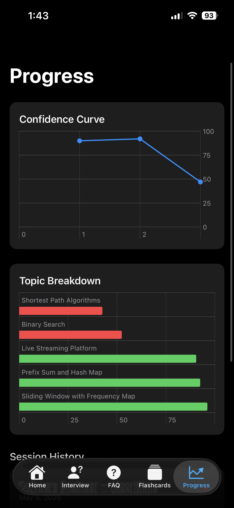
  &nbsp;&nbsp;
  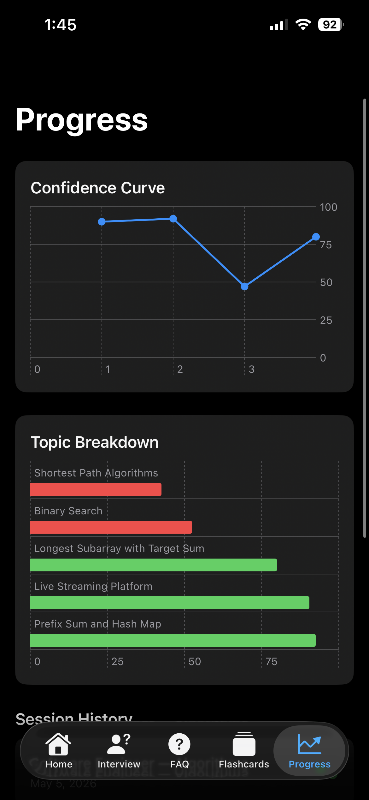
</p>

<p align="center">
  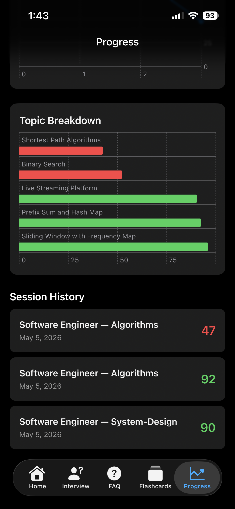
  &nbsp;&nbsp;
  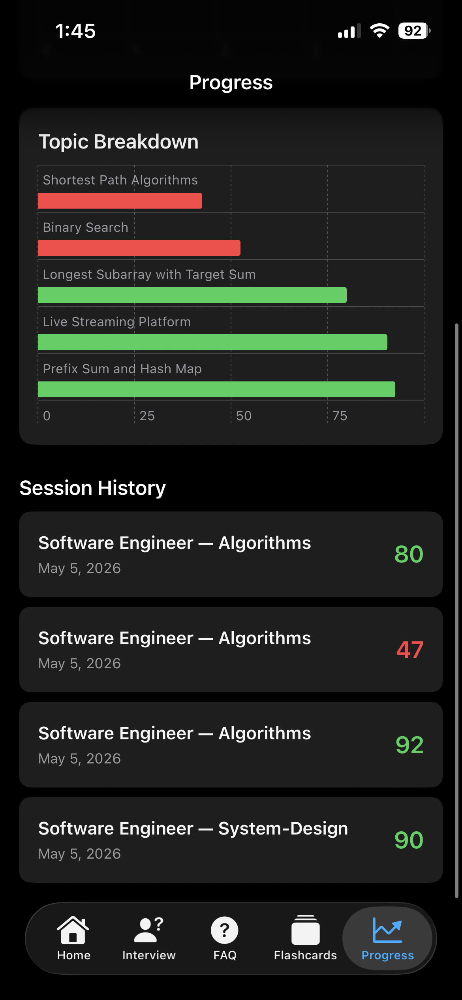
</p>

**Confidence Curve** — Line chart plotting overall session scores chronologically. The two views above show the dashboard before and after completing a new session:
- Before (3 sessions): scores ~85 → 85 → ~50 (a dip on a harder session)
- After (4 sessions): scores ~85 → 85 → ~55 → 75 (recovery visible — the fourth session scored 80)

This curve gives an immediate visual signal of trajectory. A flat or rising curve means the user is maintaining performance. A dip followed by recovery (as shown here) is a healthy learning pattern.

**Topic Breakdown** — Horizontal bar chart, colour-coded by score range:
- **Red bars** — Weak areas needing attention (Shortest Path Algorithms, Binary Search)
- **Green bars** — Strong areas (Live Streaming Platform, Prefix Sum and Hash Map, Sliding Window with Frequency Map, Longest Subarray with Target Sum)

Topics are ranked weakest-first so the most urgent items appear at the top.

**Session History** — Chronological list of every completed session showing domain and score. The final view shows all four sessions:

| Session | Domain | Score |
|---------|--------|-------|
| Software Engineer — Algorithms | Algorithms | 80 |
| Software Engineer — Algorithms | Algorithms | 47 |
| Software Engineer — Algorithms | Algorithms | 92 |
| Software Engineer — System-Design | System Design | 90 |

The 47 session stands out as a rough one — visible in the confidence curve dip and in the red bars for Shortest Path Algorithms and Binary Search. The 80 on the next algorithms session shows a bounce-back.

---

## 7. End-to-End Example Walkthrough

This section traces one complete user session from app launch to reviewing the updated progress dashboard, using real data captured from the screenshots above.

---

### Step 1 — App opens: coaching brief built silently

The user opens the app. Before any screen interaction, `MemoryBuilder` reads SwiftData and sends one API call:

**`POST /memory/synthesize`**
```json
{
  "user_profile": {
    "name": "Atharva Kulkarni",
    "role": "Software Engineer",
    "level": "junior",
    "target": "Google",
    "interview_date": "2026-06-22"
  },
  "topic_scores": [
    { "topic": "Shortest Path Algorithms", "scores": [38, 42] },
    { "topic": "Binary Search",            "scores": [45, 51] },
    { "topic": "Live Streaming Platform",  "scores": [88, 90] },
    { "topic": "Prefix Sum and Hash Map",  "scores": [80, 85] }
  ],
  "episodic_memories": [
    "Session 2 (algorithms, score 92): strong on prefix-sum problems, missed edge cases on graph traversal.",
    "Session 3 (system design, score 90): solid high-level design for Live Streaming Platform, good trade-off reasoning."
  ],
  "faq_activity": [
    { "topic": "Graph algorithms",    "times_asked": 3, "avg_self_grade": 2.8 },
    { "topic": "Breadth first search","times_asked": 2, "avg_self_grade": 3.1 }
  ]
}
```

**Response — coaching brief cached for the session:**
```json
{
  "context_summary": "Junior SWE targeting Google. Priority topics: Shortest Path Algorithms (avg 40) and Binary Search (avg 48) — both need focused work. Strengths: system design (90) and prefix-sum problems (avg 83). FAQ activity shows the candidate is actively studying graph algorithms and BFS but self-grades are modest — reinforce with concrete examples. Tone: patient and constructive. Avoid jumping to advanced optimisations before the candidate demonstrates the baseline approach."
}
```

**What the user sees:** The Home Dashboard loads instantly with their name, 48-day countdown, stats row (16 due, 76 avg, 3 sessions), and a Today's Plan tailored from their weak spots.

---

### Step 2 — FAQ: ask a question

The user taps **Ask a Question** from the home quick actions and types a question about graph algorithms — a topic they've been actively studying.

**`POST /faq/ask`**
```json
{
  "question": "What are the common graph algorithms?",
  "topic": "Graph algorithms",
  "context": "Junior SWE targeting Google. Priority topics: Shortest Path Algorithms...",
  "relevant_flashcards": []
}
```

**Response:**
```json
{
  "answer": "Common graph algorithms include Depth-First Search (DFS) and Breadth-First Search (BFS) for traversing graphs, Dijkstra's algorithm and Bellman-Ford algorithm for finding the shortest path, and Topological Sorting for ordering vertices. These algorithms are fundamental in computer science and have numerous applications in networking, database querying, and more.",
  "related_topics": ["Data Structures", "Computer Networks", "Algorithm Design"],
  "save_as_flashcard": true
}
```

The `save_as_flashcard: true` flag triggers automatic card creation. The Q&A is saved locally. The user sees the green **Saved** badge.

---

### Step 3 — FAQ: generate flashcards from notes

The user switches to the **Generate Cards** tab, types a topic and pastes study notes about BFS.

**`POST /faq/generate`**
```json
{
  "topic": "Breadth first search",
  "notes": "BFS is a graph algorithm, where we traverse to the children from parent in a level order traversal"
}
```

**Response:**
```json
{
  "flashcards": [
    { "question": "What is BFS?",
      "answer": "Breadth-First Search (BFS) is a graph algorithm that traverses a graph level by level, starting from a given source node." },
    { "question": "What type of traversal does BFS use?",
      "answer": "BFS uses level order traversal, where it visits all the nodes at a given depth before moving to the next depth level." },
    { "question": "How does BFS explore a graph?",
      "answer": "BFS explores a graph by visiting the children of a parent node before moving to the next level of children, traversing in a layer-by-layer manner." },
    { "question": "What data structure is often used to implement BFS?",
      "answer": "A queue data structure is often used to implement BFS, as it allows for efficient addition and removal of nodes to be visited." },
    { "question": "What are the key characteristics of BFS?",
      "answer": "BFS is a graph algorithm that uses level order traversal, visits nodes breadth-first, and uses a queue for implementation." }
  ],
  "topic": "Breadth first search"
}
```

5 cards are saved and immediately due for review. The Flashcards tab now shows **1/22** (the previous 17 due cards plus 5 new ones).

---

### Step 4 — Flashcard review

The user opens the Flashcards tab. Cards are shown one at a time, question first.

**Card 1 of 22:**
> Q: *What data structure is often used to implement BFS?*
> A: *A queue data structure is often used to implement BFS, as it allows for efficient addition and removal of nodes to be visited.*

User grades: **Good** (grade 3)

SM-2 calculates:
- Previous: repetitions=0, ease=2.5, interval=1
- New: repetitions=1, ease=2.5, interval=6 days
- Next review: May 11, 2026

**Card 2 of 21:**
> Q: *What type of traversal does BFS use?*
> A: *BFS uses level order traversal, where it visits all the nodes at a given depth before moving to the next depth level.*

User grades: **Hard** (grade 2)

SM-2 calculates:
- Reset: repetitions=0, interval=1 day, ease drops to 2.36
- Next review: May 6, 2026 (tomorrow — needs reinforcement)

This continues for all 22 due cards. No network calls are made during the entire flashcard session.

---

### Step 5 — Mock interview: setup

The user navigates to **Interview**. Selects:
- Role: Software Engineer
- Level: Junior
- Domain: Algorithms

Taps **Start Interview**.

**`POST /interview/start`**
```json
{
  "role": "Software Engineer",
  "level": "junior",
  "domain": "algorithms",
  "context": "Junior SWE targeting Google. Priority topics: Shortest Path Algorithms..."
}
```

**Response:**
```json
{
  "question": "Given an array of integers and a target sum, write a function to find the longest subarray with a sum equal to the target sum, and return its length."
}
```

---

### Step 6 — Answer, evaluate, repeat

The user types their approach. After submitting, the app appends the answer to `history[]`, builds a `session_delta` string locally, and calls `/interview/answer`.

**`POST /interview/answer`**
```json
{
  "role": "Software Engineer",
  "level": "junior",
  "domain": "algorithms",
  "context": "Junior SWE targeting Google...",
  "session_delta": "Q1 (Longest Subarray with Target Sum): avg 75/100 — correct approach, weak on edge cases",
  "history": [
    { "role": "interviewer", "content": "Given an array of integers and a target sum..." },
    { "role": "candidate",   "content": "I would use a prefix sum approach with a hash map to track the earliest index where each prefix sum occurred. For each index i, I compute the running sum and check if (sum - target) exists in the map. If it does, the subarray length is i minus the stored index. I track the maximum such length seen..." }
  ],
  "answer": "I would use a prefix sum approach with a hash map..."
}
```

**Response:**
```json
{
  "scores": {
    "clarity": 80,
    "correctness": 90,
    "communication": 70,
    "edge_cases": 60
  },
  "feedback": "The solution is mostly correct, but the initial mention of Kadane's algorithm is misleading since the provided code uses a prefix-sum map. The explanation and code are generally clear, but could be improved by more directly addressing how the prefix-sum map handles different value ranges and edge cases.",
  "topic": "Longest Subarray with Target Sum",
  "next_question": "Given a string, implement a function to find all permutations of the string using a backtracking approach, ensuring each character is used exactly once in each permutation."
}
```

The feedback card appears in the conversation with the 4 score bars. The score is saved to SwiftData. The next question appears and the session continues.

---

### Step 7 — End session

The user taps **End** → **End & Save**.

**`POST /interview/summarise`**
```json
{
  "role": "Software Engineer",
  "level": "junior",
  "context": "Junior SWE targeting Google...",
  "session_delta": "Q1 (Longest Subarray with Target Sum): avg 75 — correct, weak edge cases\nQ2 (String Permutations): avg 85 — strong backtracking explanation",
  "scores": [
    { "topic": "Longest Subarray with Target Sum", "clarity": 80, "correctness": 90, "communication": 70, "edge_cases": 60 },
    { "topic": "String Permutations",              "clarity": 88, "correctness": 85, "communication": 82, "edge_cases": 74 }
  ]
}
```

**Response:**
```json
{
  "overall_score": 80,
  "strong_areas": ["Prefix sum pattern recognition", "Backtracking explanation"],
  "weak_spots": ["Edge case handling", "Communication clarity under pressure"],
  "summary": "Strong fundamentals on array and recursion problems. The prefix-sum approach was correct but the explanation wavered — lead with the pattern name and data structure choice before walking through the logic.",
  "next_focus": "Practice explaining edge cases explicitly: what happens with negative numbers, empty input, or when no valid subarray exists."
}
```

The session is saved. An `EpisodicMemory` record is written with this summary.

---

### Step 8 — Progress updates

After saving, the user checks the Progress dashboard.

**Before this session:** 3 sessions — scores 47, 92, 90. Confidence curve shows a dip then recovery.

**After this session:** 4 sessions — scores 47, 92, 90, 80. The curve now shows a fourth point at 80. Topic Breakdown adds a green bar for **Longest Subarray with Target Sum**, while Shortest Path Algorithms and Binary Search remain red — flagging where to focus next.

The 80 on this session lifts the rolling average. The next coaching brief will reference this session's weak spots (edge case handling) and incorporate the new topic scores into the priority ranking.

---

### Full session at a glance

```
App opens
  └─▶ MemoryBuilder reads SwiftData (local, no network)
      └─▶ POST /memory/synthesize  ──▶  context_summary cached on iOS

FAQ tab
  └─▶ POST /faq/ask               ──▶  answer + save_as_flashcard: true
      └─▶ card created in SwiftData, enters SM-2 queue
  └─▶ POST /faq/generate          ──▶  5 BFS flashcards
      └─▶ 5 cards added to SwiftData, all due tomorrow

Flashcards tab
  └─▶ SM-2 review loop            ──▶  no network calls
      └─▶ each grade updates ease_factor + next_review_date in SwiftData

Interview tab
  └─▶ POST /interview/start       ──▶  opening algorithm question
  └─▶ [per answer]
      └─▶ session_delta built locally (no network)
      └─▶ POST /interview/answer  ──▶  scores + feedback + next question
          └─▶ score saved to SwiftData
  └─▶ POST /interview/summarise   ──▶  overall score, strong areas, weak spots
      └─▶ InterviewSession + EpisodicMemory saved to SwiftData

Progress tab
  └─▶ Reads SwiftData (local, no network)
      └─▶ Confidence curve updated, topic breakdown updated, session appended
```
