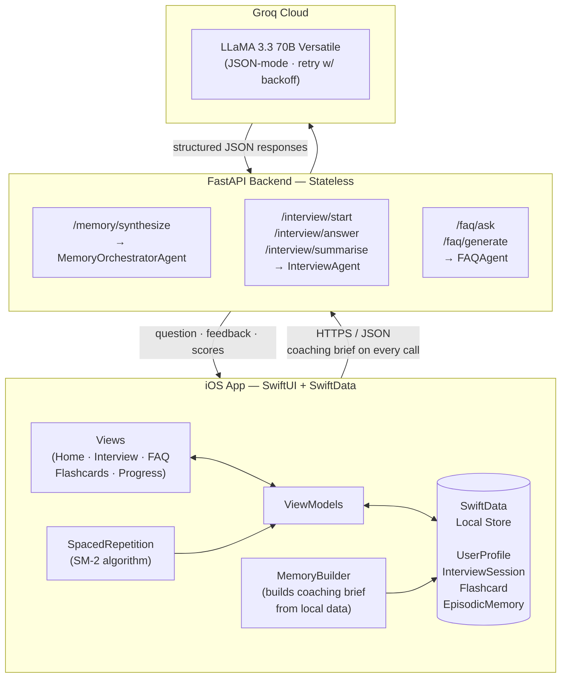

# Interview Prep Agent

An AI-powered interview preparation app — iOS front-end with a stateless FastAPI backend, powered by LLaMA 3.3 70B via Groq. Practice mock interviews, ask technical questions, review flashcards, and track your progress — all personalised to your profile and interview timeline.

---

## Features

### Mock Interviews
- Choose a role (SWE, PM, Data Scientist, etc.), experience level, and domain
- Domains: **Behavioral** (STAR-format), **System Design**, **Technical / DSA**
- Each answer is evaluated across four rubric dimensions: **Clarity**, **Correctness**, **Communication**, and **Edge Cases**
- Real-time follow-up questions that stay locked to the chosen domain
- End-of-session summary with overall score, strong areas, weak spots, and the single most important topic to study next

### FAQ / Q&A Assistant
- Ask any technical or career question in natural language
- Answers are personalised using your coaching profile and relevant flashcards you already own
- One-tap save to flashcard — answered cards enter the spaced repetition queue automatically

### Flashcard System
- Auto-generate flashcards from raw study notes (topic + freeform text → 5–15 cards)
- SM-2 spaced repetition algorithm schedules each card individually
- Grade 0–5 per review; ease factor and interval update in real time
- "Due Today" count surfaced on the home dashboard

### Progress Dashboard
- 7-session rolling average score
- Weak spots ranked by frequency across all sessions
- Per-topic score trends (oldest → newest) with improving / stable / declining labels
- Full session history with timestamps and domain breakdown

### Coaching Memory
- Before each session, the app builds a structured coaching brief from local SwiftData — no user input required
- The brief captures: top priority topics, topics to skip, score trends, recent session summaries, and FAQ activity
- Cached for the duration of the session and sent with every API call so the AI always has full context

---

## System Architecture



### How the stateless design works

The backend holds **zero state** between requests. The iOS app is the single source of truth:

| What | Where it lives |
|------|----------------|
| User profile, sessions, scores | SwiftData (on-device) |
| Flashcards + SM-2 metadata | SwiftData (on-device) |
| Episodic session memories | SwiftData (on-device) |
| Coaching brief (per session) | Built by `MemoryBuilder`, cached in-memory on iOS |
| Session conversation history | Sent in full with each `/interview/answer` request |

This means the backend can be scaled horizontally with no shared session store.

---

## Tech Stack

| Layer | Technology |
|-------|------------|
| iOS | Swift 5.9, SwiftUI, SwiftData |
| Backend | Python 3.11, FastAPI, Uvicorn |
| AI Model | LLaMA 3.3 70B Versatile via Groq API |
| Data validation | Pydantic v2 |
| iOS build | XcodeGen (`project.yml`) |

---

## Project Structure

```
.
├── backend/
│   ├── main.py                  # FastAPI app, CORS, request logging middleware
│   ├── requirements.txt
│   ├── .env.example
│   ├── agents/
│   │   ├── interview_agent.py   # start · evaluate · summarise
│   │   ├── faq_agent.py         # answer · generate_flashcards
│   │   └── memory_agent.py      # synthesize coaching brief
│   ├── routers/
│   │   ├── interview.py
│   │   ├── faq.py
│   │   └── memory.py
│   ├── models/
│   │   └── schemas.py           # Pydantic request/response models
│   └── services/
└── ios/
    ├── project.yml              # XcodeGen spec
    └── AIAgentApp/
        ├── AIAgentApp.swift     # App entry, SwiftData container setup
        ├── Models/
        │   └── SwiftDataModels.swift
        ├── Services/
        │   ├── APIService.swift          # all network calls
        │   ├── APIModels.swift           # Codable request/response types
        │   ├── MemoryBuilder.swift       # builds /memory/synthesize payload
        │   └── SpacedRepetition.swift    # SM-2 implementation
        ├── ViewModels/
        │   ├── InterviewViewModel.swift
        │   └── FAQViewModel.swift
        └── Views/
            ├── HomeView.swift
            ├── InterviewView.swift
            ├── FAQView.swift
            ├── FlashcardsView.swift
            └── ProgressDashboardView.swift
```

---

## Setup

### Prerequisites

- Python 3.11+
- Xcode 15+ (for the iOS app)
- [XcodeGen](https://github.com/yonaskolb/XcodeGen) — `brew install xcodegen`
- A [Groq API key](https://console.groq.com)

---

### Backend

```bash
cd backend

# Create and activate virtual environment
python -m venv .venv
source .venv/bin/activate

# Install dependencies
pip install -r requirements.txt

# Configure environment
cp .env.example .env
# Open .env and add your GROQ_API_KEY
```

**.env.example**
```
GROQ_API_KEY=your_groq_api_key_here
```

Start the server:

```bash
uvicorn main:app --reload --port 8000
```

The API will be available at `http://localhost:8000`. Check `GET /health` to verify.

---

### iOS App

```bash
cd ios

# Generate the Xcode project from project.yml
xcodegen generate

# Open in Xcode
open AIAgentApp.xcodeproj
```

Update the base URL in `Services/APIService.swift` to point to your backend (defaults to `http://localhost:8000`), then build and run on simulator or device.

---

## API Reference

| Method | Endpoint | Description |
|--------|----------|-------------|
| `POST` | `/memory/synthesize` | Generate a personalised coaching brief from user history |
| `POST` | `/interview/start` | Start an interview session, receive the opening question |
| `POST` | `/interview/answer` | Submit an answer, receive scores + feedback + next question |
| `POST` | `/interview/summarise` | End session, receive overall score and study recommendations |
| `POST` | `/faq/ask` | Ask a technical question, receive a contextualised answer |
| `POST` | `/faq/generate` | Convert study notes into a set of flashcards |
| `GET`  | `/health` | Health check |

Full request/response schemas are in [`backend/models/schemas.py`](backend/models/schemas.py).

---

## Environment Variables

| Variable | Required | Description |
|----------|----------|-------------|
| `GROQ_API_KEY` | Yes | API key from [console.groq.com](https://console.groq.com) |
