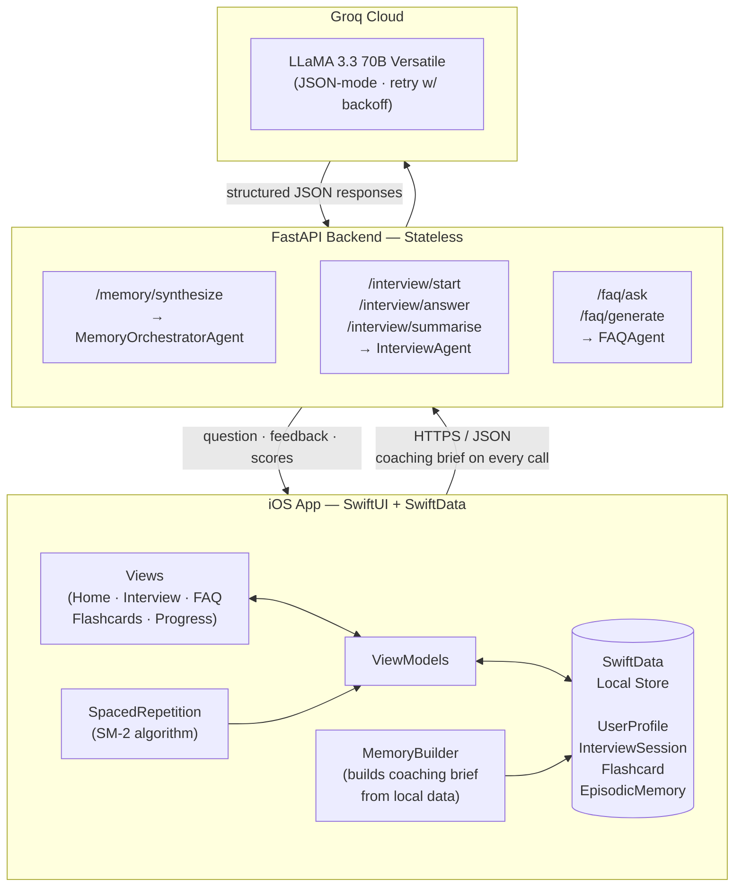

# Interview Prep Agent

An AI-powered interview preparation app — iOS front-end with a stateless FastAPI backend, powered by LLaMA 3.3 70B via Groq. Practice mock interviews, ask technical questions, review flashcards, and track your progress — all personalised to your profile and interview timeline.

---

## Features

### Mock Interviews
- Choose a role (SWE, PM, Data Scientist, etc.), experience level, and domain
- Domains: **Behavioral** (STAR-format), **System Design**, **Technical / DSA**
- Each answer is evaluated across four rubric dimensions: **Clarity**, **Correctness**, **Communication**, and **Edge Cases**
- Real-time follow-up questions that stay locked to the chosen domain
- End-of-session summary with overall score, strong areas, weak spots, and the single most important topic to study next

### FAQ / Q&A Assistant
- Ask any technical or career question in natural language
- Answers are personalised using your coaching profile and relevant flashcards you already own
- One-tap save to flashcard — answered cards enter the spaced repetition queue automatically

### Flashcard System
- Auto-generate flashcards from raw study notes (topic + freeform text → 5–15 cards)
- SM-2 spaced repetition algorithm schedules each card individually
- Grade 0–5 per review; ease factor and interval update in real time
- "Due Today" count surfaced on the home dashboard

### Progress Dashboard
- 7-session rolling average score
- Weak spots ranked by frequency across all sessions
- Per-topic score trends (oldest → newest) with improving / stable / declining labels
- Full session history with timestamps and domain breakdown

### Coaching Memory
- Before each session, the app builds a structured coaching brief from local SwiftData — no user input required
- The brief captures: top priority topics, topics to skip, score trends, recent session summaries, and FAQ activity
- Cached for the duration of the session and sent with every API call so the AI always has full context

---

## System Architecture



### How the stateless design works

The backend holds **zero state** between requests. The iOS app is the single source of truth:

| What | Where it lives |
|------|----------------|
| User profile, sessions, scores | SwiftData (on-device) |
| Flashcards + SM-2 metadata | SwiftData (on-device) |
| Episodic session memories | SwiftData (on-device) |
| Coaching brief (per session) | Built by `MemoryBuilder`, cached in-memory on iOS |
| Session conversation history | Sent in full with each `/interview/answer` request |

This means the backend can be scaled horizontally with no shared session store.

---

## Example Flow

A complete walkthrough of one prep session — from opening the app to reviewing flashcards.

**Scenario:** Atharva is a mid-level SWE with a Google interview in 12 days. He wants to do a behavioral mock interview, then ask a follow-up question and save it as a flashcard.

---

### Step 1 — App launch: build the coaching brief

When the session starts the app reads all local SwiftData silently (no user action needed) and calls `/memory/synthesize` once. The returned `context_summary` is cached and attached to every subsequent API call.

**Request — `POST /memory/synthesize`**
```json
{
  "user_profile": {
    "name": "Atharva",
    "role": "Software Engineer",
    "level": "mid",
    "target": "Google",
    "interview_date": "2026-05-17"
  },
  "topic_scores": [
    { "topic": "conflict resolution", "scores": [52, 61, 70] },
    { "topic": "leadership",          "scores": [80, 83] },
    { "topic": "system design",       "scores": [45, 48] }
  ],
  "episodic_memories": [
    "Session 3 (behavioral): struggled to quantify impact in STAR answers. Feedback: add metrics.",
    "Session 4 (system design): good high-level design, weak on capacity estimation."
  ],
  "faq_activity": [
    { "topic": "STAR method",      "times_asked": 4, "avg_self_grade": 3.2 },
    { "topic": "system design",    "times_asked": 2, "avg_self_grade": 2.5 }
  ]
}
```

**Response**
```json
{
  "context_summary": "Atharva is a mid-level SWE targeting Google in 12 days. Priority: conflict resolution — scores improving (52→70) but still below 75; push for quantified impact in STAR answers. Leadership is a strength (avg 82) — use sparingly to build confidence. Avoid system design for now (avg 47, weak capacity estimation). Tone: direct and encouraging. Tip: he revisits STAR method FAQs frequently — prompt him to cite numbers when describing results."
}
```

---

### Step 2 — Start the interview

The user selects **Behavioral** domain and taps Start. The cached `context_summary` goes in as `context`.

**Request — `POST /interview/start`**
```json
{
  "role": "Software Engineer",
  "level": "mid",
  "domain": "behavioral",
  "context": "Atharva is a mid-level SWE targeting Google in 12 days. Priority: conflict resolution..."
}
```

**Response**
```json
{
  "question": "Tell me about a time you disagreed with a teammate's technical decision. How did you handle it, and what was the outcome?"
}
```

---

### Step 3 — Submit answer, receive scores + follow-up

Atharva types his answer. The app appends it to `history`, computes `session_delta` locally, and posts to `/interview/answer`.

**Request — `POST /interview/answer`**
```json
{
  "role": "Software Engineer",
  "level": "mid",
  "domain": "behavioral",
  "context": "Atharva is a mid-level SWE targeting Google in 12 days...",
  "session_delta": "Q1 (conflict resolution): avg 68/100 — good structure, missing quantified outcome",
  "history": [
    {
      "role": "interviewer",
      "content": "Tell me about a time you disagreed with a teammate's technical decision. How did you handle it, and what was the outcome?"
    },
    {
      "role": "candidate",
      "content": "During a backend refactor, my teammate wanted to rewrite our auth service from scratch. I thought it was too risky given our deadline, so I put together a comparison doc showing the estimated time vs. risk of both approaches. We discussed it with the team lead and agreed on a smaller incremental migration. The refactor shipped on time and we avoided two weeks of potential rework."
    }
  ],
  "answer": "During a backend refactor, my teammate wanted to rewrite our auth service from scratch..."
}
```

**Response**
```json
{
  "scores": {
    "clarity": 82,
    "correctness": 78,
    "communication": 85,
    "edge_cases": 60
  },
  "feedback": "Good STAR structure with a clear action and resolution. The outcome is mentioned but lacks numbers — how much time did the incremental approach actually save, and did you measure any post-launch stability? Adding a concrete metric here would make this answer significantly stronger at Google.",
  "topic": "conflict resolution",
  "next_question": "Describe a situation where you had to influence a decision without having direct authority. What approach did you take?"
}
```

---

### Step 4 — Wrap up: session summary

After 4–5 questions Atharva taps End Session. The app sends all collected scores to `/interview/summarise`.

**Request — `POST /interview/summarise`**
```json
{
  "role": "Software Engineer",
  "level": "mid",
  "context": "Atharva is a mid-level SWE targeting Google in 12 days...",
  "session_delta": "Q1 (conflict resolution): avg 76 — missing metrics\nQ2 (influence without authority): avg 81 — strong\nQ3 (failure): avg 69 — vague outcome\nQ4 (teamwork): avg 88 — best answer",
  "scores": [
    { "topic": "conflict resolution",       "clarity": 82, "correctness": 78, "communication": 85, "edge_cases": 60 },
    { "topic": "influence without authority","clarity": 88, "correctness": 80, "communication": 84, "edge_cases": 72 },
    { "topic": "failure & learning",         "clarity": 70, "correctness": 65, "communication": 74, "edge_cases": 60 },
    { "topic": "teamwork",                  "clarity": 90, "correctness": 85, "communication": 92, "edge_cases": 78 }
  ]
}
```

**Response**
```json
{
  "overall_score": 77,
  "strong_areas": [
    "Teamwork and collaboration",
    "Influencing without authority"
  ],
  "weak_spots": [
    "Quantifying outcomes with data",
    "Describing failure with specific learnings"
  ],
  "summary": "Atharva shows strong interpersonal communication and a clear sense of narrative structure. The main gap is specificity — answers resolve positively but rarely include numbers, timelines, or measurable impact, which is a bar Google interviewers consistently hold.",
  "next_focus": "Practice STAR answers where the Result includes at least one metric (time saved, error rate, revenue impact, etc.)"
}
```

---

### Step 5 — Follow-up question via FAQ

After the session Atharva asks a question about something that came up.

**Request — `POST /faq/ask`**
```json
{
  "question": "How do I make my STAR answers more data-driven when I don't always have exact numbers?",
  "topic": "STAR method",
  "context": "Atharva is a mid-level SWE targeting Google in 12 days...",
  "relevant_flashcards": [
    {
      "question": "What does STAR stand for?",
      "answer": "Situation, Task, Action, Result.",
      "topic": "STAR method"
    }
  ]
}
```

**Response**
```json
{
  "answer": "Even without exact metrics, you can use relative or estimated numbers: 'reduced deployment time by roughly 40%', 'the bug affected around 200 users per week', or 'we cut the review cycle from 3 days to same-day'. Ranges and approximations are acceptable — what matters is showing you think in terms of impact. Before your interview, spend 10 minutes writing one number next to each story you plan to use.",
  "related_topics": [
    "Quantifying engineering impact",
    "Common behavioral interview mistakes",
    "Google interview rubric"
  ],
  "save_as_flashcard": true
}
```

The app sees `save_as_flashcard: true` and creates a new card locally in SwiftData. It enters the SM-2 queue with default ease factor 2.5 and first review due tomorrow.

---

### Step 6 — Generate flashcards from study notes

Atharva pastes his notes on system design capacity estimation and generates cards.

**Request — `POST /faq/generate`**
```json
{
  "topic": "Capacity Estimation",
  "notes": "QPS = queries per second. Start with DAU (daily active users). Assume 10% are active concurrently. Read:write ratio usually 100:1 for social apps. 1 server handles ~1000 QPS. Storage: 1 photo ≈ 300KB. 1 tweet ≈ 280 bytes. Latency targets: p99 < 200ms. Always consider CDN for static assets. Back-of-envelope: estimate then sanity check."
}
```

**Response**
```json
{
  "flashcards": [
    {
      "question": "How do you estimate QPS from DAU?",
      "answer": "Multiply DAU by the fraction active concurrently (typically 10%), then divide by 86,400 seconds. Example: 10M DAU × 10% / 86,400 ≈ 116 QPS."
    },
    {
      "question": "What is a typical read:write ratio for a social app?",
      "answer": "Around 100:1 — reads heavily dominate. Design your caching and replication strategy around this asymmetry."
    },
    {
      "question": "Roughly how much QPS can a single server handle?",
      "answer": "A commodity web server handles ~1,000 QPS. Use this as the baseline when estimating how many servers you need."
    },
    {
      "question": "What are common storage sizes to memorise for estimation?",
      "answer": "1 photo ≈ 300 KB, 1 tweet/short text ≈ 280 bytes, 1 minute of HD video ≈ 100 MB. These let you quickly back-of-envelope storage totals."
    },
    {
      "question": "What latency target is commonly expected at the p99 level?",
      "answer": "p99 < 200 ms is a widely cited target. Anything above 500 ms at p99 usually signals a design problem worth calling out."
    }
  ],
  "topic": "Capacity Estimation"
}
```

All 5 cards are saved to SwiftData and scheduled for first review tomorrow.

---

### Full session at a glance

```
App launch
  └─▶ MemoryBuilder reads SwiftData (local, no network)
      └─▶ POST /memory/synthesize  ──▶  context_summary cached

Start interview
  └─▶ POST /interview/start        ──▶  opening question

  [for each answer]
  └─▶ POST /interview/answer       ──▶  scores + feedback + next question
      └─▶ session_delta updated locally on iOS (no network call)

End session
  └─▶ POST /interview/summarise    ──▶  overall score, strong areas, weak spots
      └─▶ EpisodicMemory saved to SwiftData

Study mode
  └─▶ POST /faq/ask                ──▶  answer + related topics
      └─▶ if save_as_flashcard: card created in SwiftData

  └─▶ POST /faq/generate           ──▶  5–15 flashcards from notes
      └─▶ cards added to SwiftData, SM-2 queue starts
```

---

## Tech Stack

| Layer | Technology |
|-------|------------|
| iOS | Swift 5.9, SwiftUI, SwiftData |
| Backend | Python 3.11, FastAPI, Uvicorn |
| AI Model | LLaMA 3.3 70B Versatile via Groq API |
| Data validation | Pydantic v2 |
| iOS build | XcodeGen (`project.yml`) |

---

## Project Structure

```
.
├── backend/
│   ├── main.py                  # FastAPI app, CORS, request logging middleware
│   ├── requirements.txt
│   ├── .env.example
│   ├── agents/
│   │   ├── interview_agent.py   # start · evaluate · summarise
│   │   ├── faq_agent.py         # answer · generate_flashcards
│   │   └── memory_agent.py      # synthesize coaching brief
│   ├── routers/
│   │   ├── interview.py
│   │   ├── faq.py
│   │   └── memory.py
│   ├── models/
│   │   └── schemas.py           # Pydantic request/response models
│   └── services/
└── ios/
    ├── project.yml              # XcodeGen spec
    └── AIAgentApp/
        ├── AIAgentApp.swift     # App entry, SwiftData container setup
        ├── Models/
        │   └── SwiftDataModels.swift
        ├── Services/
        │   ├── APIService.swift          # all network calls
        │   ├── APIModels.swift           # Codable request/response types
        │   ├── MemoryBuilder.swift       # builds /memory/synthesize payload
        │   └── SpacedRepetition.swift    # SM-2 implementation
        ├── ViewModels/
        │   ├── InterviewViewModel.swift
        │   └── FAQViewModel.swift
        └── Views/
            ├── HomeView.swift
            ├── InterviewView.swift
            ├── FAQView.swift
            ├── FlashcardsView.swift
            └── ProgressDashboardView.swift
```

---

## Setup

### Prerequisites

- Python 3.11+
- Xcode 15+ (for the iOS app)
- [XcodeGen](https://github.com/yonaskolb/XcodeGen) — `brew install xcodegen`
- A [Groq API key](https://console.groq.com)

---

### Backend

```bash
cd backend

# Create and activate virtual environment
python -m venv .venv
source .venv/bin/activate

# Install dependencies
pip install -r requirements.txt

# Configure environment
cp .env.example .env
# Open .env and add your GROQ_API_KEY
```

**.env.example**
```
GROQ_API_KEY=your_groq_api_key_here
```

Start the server:

```bash
uvicorn main:app --reload --port 8000
```

The API will be available at `http://localhost:8000`. Check `GET /health` to verify.

---

### iOS App

```bash
cd ios

# Generate the Xcode project from project.yml
xcodegen generate

# Open in Xcode
open AIAgentApp.xcodeproj
```

Update the base URL in `Services/APIService.swift` to point to your backend (defaults to `http://localhost:8000`), then build and run on simulator or device.

---

## API Reference

| Method | Endpoint | Description |
|--------|----------|-------------|
| `POST` | `/memory/synthesize` | Generate a personalised coaching brief from user history |
| `POST` | `/interview/start` | Start an interview session, receive the opening question |
| `POST` | `/interview/answer` | Submit an answer, receive scores + feedback + next question |
| `POST` | `/interview/summarise` | End session, receive overall score and study recommendations |
| `POST` | `/faq/ask` | Ask a technical question, receive a contextualised answer |
| `POST` | `/faq/generate` | Convert study notes into a set of flashcards |
| `GET`  | `/health` | Health check |

Full request/response schemas are in [`backend/models/schemas.py`](backend/models/schemas.py).

---

## Environment Variables

| Variable | Required | Description |
|----------|----------|-------------|
| `GROQ_API_KEY` | Yes | API key from [console.groq.com](https://console.groq.com) |
